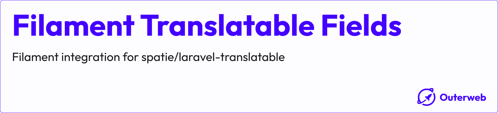

# Filament Translatable Fields

[](https://packagist.org/packages/outerweb/filament-translatable-fields)
[](https://github.com/outer-web/filament-translatable-fields/actions?query=workflow%3Arun-tests+branch%3Amain)
[](https://github.com/outer-web/filament-translatable-fields/actions?query=workflow%3A"Fix+PHP+code+style+issues"+branch%3Amain)
[](https://packagist.org/packages/outerweb/filament-translatable-fields)

This Filament plugin provides an integration for the [spatie/laravel-translatable](https://github.com/spatie/laravel-translatable) package.

It can easily be combined with the [lara-zeus/translatable](https://github.com/lara-zeus/translatable) package as our package only provides the Form integration.

Instead of rendering a dropdown to select the locale, it wraps the translatable fields in a Tabs component for a better user experience.

> ⚠️ **Caution:** V4 is a complete rewrite of the package and logic. Please take a look at the installation instructions below!

## Table of Contents

-   [Installation](#installation)
-   [Configuration](#configuration)
-   [Usage](#usage)
-   [Changelog](#changelog)
-   [License](#license)

## Installation

You can install the package via composer:

```bash
composer require outerweb/filament-translatable-fields
```

Add the plugin to your panel:

```php
use Outerweb\FilamentTranslatableFields\TranslatableFieldsPlugin;

public function panel(Panel $panel): Panel
{
    return $panel
        // ...
        ->plugins([
            // ...
            TranslatableFieldsPlugin::make(),
        ]);
}
```

## Configuration

### Supported locales

By default, the package will try to read out the supported locales from the `config/app.php` file. It will check for `app.supported_locales` first and then fallback to `app.locales` and `app.fallback_locale`.

You can manually configure the supported locales like this:

```php
use Outerweb\FilamentTranslatableFields\TranslatableFieldsPlugin;

public function panel(Panel $panel): Panel
{
    return $panel
        // ...
        ->plugins([
            // ...
            TranslatableFieldsPlugin::make()
                ->supportedLocales(['en', 'de', 'fr']),
        ]);
}
```

If you want to provide custom labels for the locales, you can do it like this:

```php
use Outerweb\FilamentTranslatableFields\TranslatableFieldsPlugin;

public function panel(Panel $panel): Panel
{
    return $panel
        // ...
        ->plugins([
            // ...
            TranslatableFieldsPlugin::make()
                ->supportedLocales([
                    'en' => 'English',
                    'de' => 'Deutsch',
                    'fr' => 'Français',
                ]),
        ]);
}
```

If you want to dynamically provide the supported locales, you can also pass a Closure to the `supportedLocales()` method:

```php
use Outerweb\FilamentTranslatableFields\TranslatableFieldsPlugin;

public function panel(Panel $panel): Panel
{
    return $panel
        // ...
        ->plugins([
            // ...
            TranslatableFieldsPlugin::make()
                ->supportedLocales(fn () => getSupportedLocales()),
        ]);
}
```

### Default locale

By default, the active tab will be the one of the app's locale when rendering the form. You can change this behavior by setting a default locale:

```php
use Outerweb\FilamentTranslatableFields\TranslatableFieldsPlugin;

public function panel(Panel $panel): Panel
{
    return $panel
        // ...
        ->plugins([
            // ...
            TranslatableFieldsPlugin::make()
                ->defaultLocale('de'),
        ]);
}
```

If you want to dynamically provide the default locale, you can also pass a Closure to the `defaultLocale()` method:

```php
use Outerweb\FilamentTranslatableFields\TranslatableFieldsPlugin;

public function panel(Panel $panel): Panel
{
    return $panel
        // ...
        ->plugins([
            // ...
            TranslatableFieldsPlugin::make()
                ->defaultLocale(fn () => auth()->user()->preferred_locale),
        ]);
}
```

## Usage

### Marking single fields as translatable

To mark a single field as translatable, you can use the `translatable()` method on any Filament form field:

```php
use Filament\Forms\Components\TextInput;

TextInput::make('name')
    ->translatable(),
```

This will wrap the field in a Tabs component with a tab for each supported locale.

> **Note:** Make sure to place the `translatable()` method at the end of the field definition to avoid any unexpected behavior.

#### Modifying/Validating a field for a specific locale

All modifiers and validation rules applied before calling the `translatable()` method will be applied field for each locale. If you want to apply a modifier or validation rule for a specific locale only, you can use the `modifyLocalizedFieldUsing` parameter in the `translatable()` method:

```php
use Filament\Forms\Components\TextInput;

TextInput::make('name')
    ->translatable(
        modifyLocalizedFieldUsing: function (TextInput $field, string $locale): TextInput {
            return match ($locale) {
                'en' => $field->required(),
                default => $field,
            };
        },
    ),
```

#### Conditionally marking a field as translatable

You can also conditionally mark a field as translatable by passing a bool or Closure to the `translatable()` method:

```php
use Filament\Forms\Components\TextInput;

// Using a bool
TextInput::make('name')
    ->translatable(false),

// Using a Closure
TextInput::make('name')
    ->translatable(fn () => someCondition()),
```

#### Overriding the supported locales for a single field

You can override the supported locales for a single field by passing an array or Closure to the `translatable()` method:

```php
use Filament\Forms\Components\TextInput;

// Using an array
TextInput::make('name')
    ->translatable(
        supportedLocales: ['en', 'de']
    ),

// Using a Closure
TextInput::make('name')
    ->translatable(
        supportedLocales: fn () => getSupportedLocales(),
    ),
```

#### Overriding the default locale for a single field

You can override the default locale for a single field by passing a string or Closure to the `translatable()` method:

```php
use Filament\Forms\Components\TextInput;

// Using a string
TextInput::make('name')
    ->translatable(
        defaultLocale: 'de'
    ),

// Using a Closure
TextInput::make('name')
    ->translatable(
        defaultLocale: fn () => auth()->user()->preferred_locale,
    ),
```

### Marking a group of fields as translatable

You can also mark a [Layout](https://filamentphp.com/docs/4.x/schemas/layouts) component as translatable. This will make all fields inside the layout translatable:

```php
use Filament\Schemas\Components\Section;

Section::make()
    ->schema([
        TextInput::make('name'),
        TextInput::make('description'),
    ])
    ->translatable(),
```

This will wrap all fields inside the layout in a Tabs component with a tab for each supported locale.

> **Note:** Make sure to place the `translatable()` method at the end of the component definition to avoid any unexpected behavior.

All the options described for single fields (modifying/validating a field for a specific locale, conditionally marking as translatable, overriding supported/default locales) are also available when marking a layout component as translatable.

For modifying/validating fields inside a layout component, the provided Closure will be called for each field inside the layout.

Example:

```php
use Illuminate\Support\Str;
use Filament\Forms\Components\TextInput;
use Filament\Schemas\Components\Component;
use Filament\Schemas\Components\Section;

Section::make()
    ->schema([
        TextInput::make('name'),
        TextInput::make('description'),
    ])
    ->translatable(
        modifyLocalizedFieldUsing: function (Component $field, string $locale): Component {
            if ($field instanceof TextInput && Str::startsWith($field->getName(), 'name.')) {
                return match ($locale) {
                    'en' => $field->required(),
                    default => $field,
                };
            }

            return $field;
        },
    ),
```

## Changelog

Please see [CHANGELOG](CHANGELOG.md) for more information on what has changed recently.

## License

The MIT License (MIT). Please see [License File](LICENSE.md) for more information.
